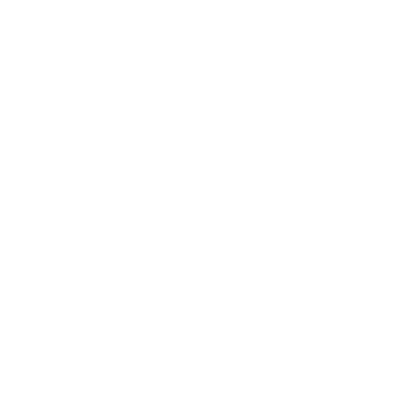

<h2 align="center">
   
  
   
  BotAllen Kodi
   
</h2>

<h4 align="center">BotAllen Kodi Repository</h4>

 

## Highlights

- [JioTV Addon](https://github.com/botallen/repository.botallen/tree/master/plugin.video.jiotv)

## Download

[**Download**](https://github.com/botallen/repository.botallen/raw/master/repository.botallen/repository.botallen-1.0.0.zip) the `.zip` file.
