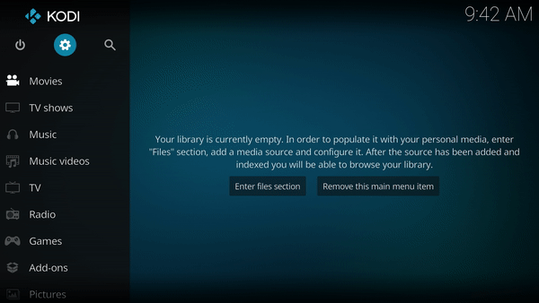

<h2 align="center">
   
  
   
  BotAllen
   
</h2>

<h4 align="center">BotAllen Kodi Repository</h4>

  <!-- Release -->
  
  
  <!-- Discord -->
  
  
  <!-- Downloads -->
  
  
 

 

  
  <!-- License -->
  
  
  <!-- Open Issues -->
  
  
  <!-- Last Commit -->
  
  
 

  

 

<h2 align="center">Add-ons</h2>

  

  

  

  

  

## Install

- Add this file source in file manager : https://kodi.botallen.com
- Click on Install From zip file
- Select repository.botallen-1.0.0.zip
- Done

 
 
 
 

## Download

[**Download**](https://github.com/botallen/repository.botallen/releases/download/v1.0.0/repository.botallen-1.0.0.zip) the `.zip` file.
 
 

## Support

  

  

